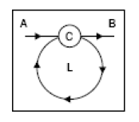
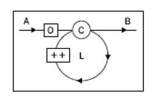

# Condiciones y Bucles

## Condiciones \(Bifurcaciones Condicionales\)

Una _condición_ es una estructura que realiza una tarea u otra dependiendo del resultado de evaluar una condición. Aquí vamos a ver:

* La estructura **IF… ELSE**
* La estructura **SWITCH**

Un [Bloque](https://developer.mozilla.org/es/Referencia_de_JavaScript_1.5/Sentencias/block) \(de código\) es el conjunto de expresiones que quedan encerradas entre llaves. Estos bloques se pueden anidar.

```javascript
{ 
    var a = 1; 
    var b = 3; 
    var c, d; 
    { 
        c = a + b; 
        { 
        d = a - b; 
    } 
}
```

### Condicional [`if - else`](https://developer.mozilla.org/es/Referencia_de_JavaScript_1.5/Sentencias/if...else)

```javascript
var result = '';
if (a > 2) { 
result = 'a is greater than 2';
}
```

Las partes de una condición if

* La sentencia `if`  
* Una condición entre paréntesis. 

    Esta condición siempre devolverá un booleano.

    Esta condición puede contener:

  * Una operación lógica: `!`, `&&` o `||`
  * Una comparación como `===`, `!=`, `>` y demás
  * Cualquier valor o variable que pueda ser convertido a Booleano
  * Una combinación de estas

* El bloque de código a ejecutar si se cumple la condición 

En el `if` tambien puede haber una parte else opcional seguido de un bloque de código que se ejecutará si la condición se evalua a `false`

```javascript
if (a > 2) { 
    result = 'a is greater than 2';
} else { 
    result = 'a is NOT greater than 2';
}
```

Entre el `if` y el `else`, pueden haber ilimitado numero de condiciones `else if`

```javascript
if (a > 2 || a < -2) { 
    result = 'a is not between -2 and 2'; 
} else if (a === 0 && b === 0) { 
    result = 'both a and b are zeros'; 
} else if (a === b) { 
    result = 'a and b are equal'; 
} else { 
    result = 'I give up'; 
}
```

Existe también lo que se llama el [operador ternario](http://blog.stchur.com/2006/07/14/the-javascript-ternary-operator/) [`?`](http://blog.stchur.com/2006/07/14/the-javascript-ternary-operator/) que nos permite abreviar algunas sentencias if simples

```javascript
var result = (a === 1) ? "a is one" : "a is not one";
```

### Condicional [`switch`](https://developer.mozilla.org/en/JavaScript/Reference/Statements/switch)

```javascript
var a = '1';
var result = '';
switch (a) { 
  case 1: 
    result = 'Number 1'; 
    break; 
  case '1': 
    result = 'String 1'; 
    break; 
  default: 
    result = 'I don\'t know'; 
    break;
}
result;
```

Las partes de un switch

* La sentencia `switch`  
* Una expresión entre paréntesis.   

    Esta expresión normalmente será una variable, pero puede ser cualquier expresión que devuelva un valor

* Cierto numero de bloques `case` entre corchetes 
* Cada sentencia `case` va seguida de una expresión.  

  El resultado de esta expresión se compara con la expresión que hay después del switch.   

  Si la comparación de igualdad devuelve `true`, se ejecuta el bloque que hay tras este `case`

* Puede \(y debe\) haber una sentencia `break` al final de cada bloque `case`.  

  Estos `break` provocan la salida del `switch` \(de esta manera nos aseguramos de ejecutar un solo bloque `case`\)

* Tambien puede \(y debe\) haber una sentencia  `default` que es seguida de un bloque de código que se ejecuta si ninguno de los `case` es evaluado a `true`

## Bucles \(Loops\)

Un bucle es una estructura que nos permite repetir un bloque de código muchas veces.

El número de repeticiones dependerá del resultado de evaluar una condición, antes \(o después\) de cada iteración

En Javascript hay 4 tipos de bucles:

* `while` loops 
* `do-while` loops 
* `for` loops 
* `for-in` loops

### El bucle [`while`](https://developer.mozilla.org/es/Referencia_de_JavaScript_1.5/Sentencias/while)

```javascript
var i = 0;
while (i < 10) { 
  i++;
}
```



La sentencia `while` va seguida de una condición entre paréntesis y un bloque de código entre corchetes. Mientras la condición se evalue a true, el código se ejecutará una y otra vez.

El número de repeticiones dependerá del resultado de evaluar una condición, antes \(o después\) de cada iteración

### El bucle [`do-while`](https://developer.mozilla.org/es/Referencia_de_JavaScript_1.5/Sentencias/do...while)

```javascript
var i = 0;
do { 
  i++;
} while (i < 10)
```

El bucle `do-while` es una pequeña variación del bucle `while`

La sentencia `do` va seguida de un bloque de código y una condición \(con `while`\) después del bloque.

Esto implica que el bloque de código se va a ejecutar siempre, al menos una vez, antes de evaluar la condición.

### El bucle [`for`](https://developer.mozilla.org/es/Referencia_de_JavaScript_1.5/Sentencias/for)

```javascript
var punishment = '';
for (var i = 0; i < 100; i++) { 
  punishment += 'I will never do this again, ';
}
```



La estrucura del bucle for tiene 3 partes claramente diferenciadas \(separadas por

* **Inicialización** _\(var i=0\)_: Código que es ejecutado antes de entrar en el bucle \[O\]
* **Evaluación** _\(i&lt;100\)_: Mientras evalue a true seguimos con el bucle \[C\]
* **Incremento** _\(i++\)_:  Código que es ejecutado después de cada iteración \[++\]

Se pueden anidar bucles `for`

```javascript
var res = '\n'; 
for(var i = 0; i < 10; i++) { 
  for(var j = 0; j < 10; j++) { 
    res += '* '; 
  } 
  res+= '\n';
}
```

### El bucle [`for-in`](https://developer.mozilla.org/es/Referencia_de_JavaScript_1.5/Sentencias/for...in)

```javascript
var a = ['a', 'b', 'c', 'x', 'y', 'z'];
var result = '\n';
for (var i in a) { 
  result += 'index: ' + i + ', value: ' + a[i] + '\n';
}
```

El bucle `for-in` es utilizado para recorrer los elementos de un array \(o de un objeto\)

Aunque basandonos en ES5 tambien podriamos utilizar [`Object.keys`](https://developer.mozilla.org/en-US/docs/Web/JavaScript/Reference/Global_Objects/Object/keys) y [`forEach`](https://developer.mozilla.org/en-US/docs/Web/JavaScript/Reference/Global_Objects/Array/forEach) y hacer

```javascript
var obj = { first: "John", last: "Doe" };

// Visit non-inherited enumerable keys
Object.keys(obj).forEach(function(key) {
    console.log(key);
});
```

